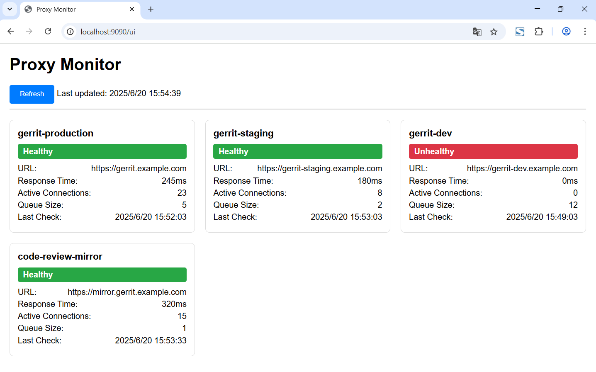

# proxy

[](https://github.com/repo-scm/proxy/actions?query=workflow%3Aci)
[](https://goreportcard.com/report/github.com/repo-scm/proxy)
[](https://github.com/repo-scm/proxy/blob/main/LICENSE)
[](https://github.com/repo-scm/proxy/tags)


## Introduction

git sites proxy


## Usage

```bash
# Deploy server
proxy serve [--address string]

# Query site
proxy query [--output string] [--verbose]

# List sites
proxy list
```


## APIs

- `GET /ui` - Get server ui
- `GET /api/status` - Get server status
- `GET /api/sites` - Get all sites
- `GET /api/sites/{site}/health` - Get site health
- `GET /api/sites/{site}/queues` - Get site queues
- `GET /api/sites/{site}/connections` - Get site connections


## Settings

[proxy](https://github.com/repo-scm/proxy) parameters can be set in the directory `$HOME/.repo-scm/proxy.yaml`.

An example of settings can be found in [proxy.yaml](https://github.com/repo-scm/proxy/blob/main/config/proxy.yaml).

```yaml
gerrits:
  - name: "gerrit_name"
    host: "gerrit_host"
    port: 29418
    user: "your_name"
    key: "/path/to/.ssh/key_file"
    weight: 0.5
```


## Screenshot

### Monitor




## License

Project License can be found [here](LICENSE).


## Reference
