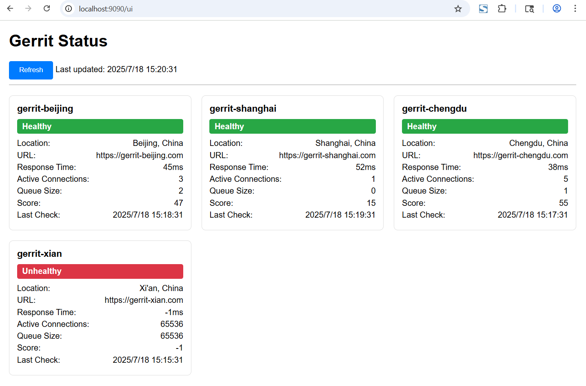

# proxy

[](https://github.com/repo-scm/proxy/actions?query=workflow%3Aci)
[](https://goreportcard.com/report/github.com/repo-scm/proxy)
[](https://github.com/repo-scm/proxy/blob/main/LICENSE)
[](https://github.com/repo-scm/proxy/tags)


## Introduction

git sites proxy


## Usage

```bash
# Deploy server
proxy serve [--address string]

# Query site
proxy query [--output string] [--site string] [--verbose]

# List sites
proxy list
```


## APIs

- `GET /ui` - Get server ui
- `GET /api/status` - Get server status
- `GET /api/sites` - Get all sites
- `GET /api/sites/{site}/health` - Get site health
- `GET /api/sites/{site}/queues` - Get site queues
- `GET /api/sites/{site}/connections` - Get site connections


## Settings

[proxy](https://github.com/repo-scm/proxy) parameters can be set in the directory `$HOME/.repo-scm/proxy.yaml`.

An example of settings can be found in [proxy.yaml](https://github.com/repo-scm/proxy/blob/main/config/proxy.yaml).

```yaml
gerrits:
  "gerrit_name":
    location: "gerrit_location"
    weight: 0.5
    http:
      url: "http://127.0.0.1:8080"
    ssh:
      host: "127.0.0.1"
      port: 29418
      user: "your_name"
      key: "/path/to/ssh/private/key"
```

> `weight`: importance factor (ranging from 0 to 1)
>
> A site with weight: 1.0 (high importance) will have its score unchanged  
> A site with weight: 0.5 (medium importance) will have its score doubled (making it less preferred)  
> A site with weight: 0.1 (low importance) will have its score multiplied by 10 (making it much less preferred)  


## Output

```json
{
  "name": "gerrit_name",
  "location": "gerrit_location",
  "url": "http://127.0.0.1:8080",
  "host": "127.0.0.1",
  "healthy": true,
  "responseTime": 136,
  "connections": 1,
  "queueSize": 19,
  "score": 88,
  "lastCheck": "2025-06-26T11:02:41.971350295+08:00",
  "error": ""
}
```


## Screenshot




## License

Project License can be found [here](LICENSE).


## Reference
